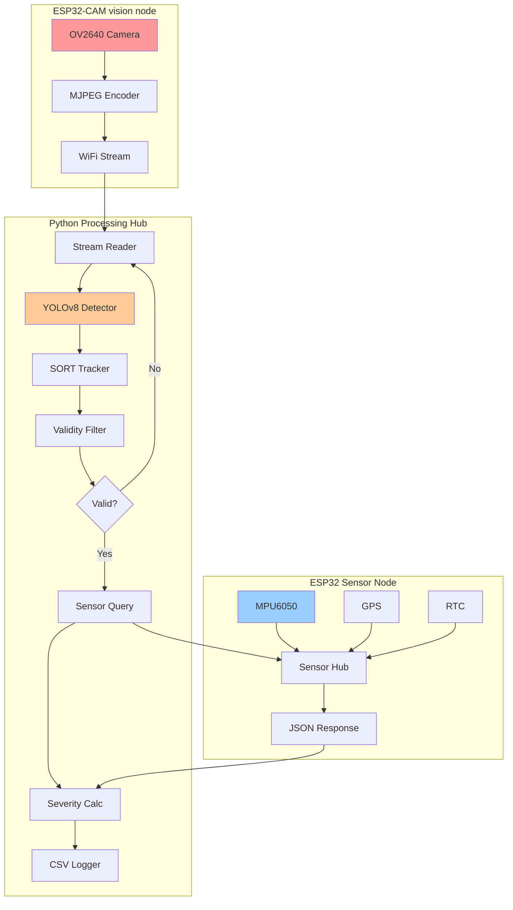

# Intelligent Pothole Detection System (IPDS) v2.0


**An advanced IoT + AI solution for real-time road hazard assessment using dual ESP32 architecture.**

---

## System Overview

IPDS combines computer vision, multi-object tracking, and sensor fusion to detect, track, and assess pothole severity in real-time. The system uses a **dual ESP32 architecture** for optimal performance and reliability.

### Key Features

- **Real-time Detection**: YOLOv8-powered pothole identification
- **Multi-Object Tracking**: SORT algorithm prevents duplicate counting
- **Sensor Fusion**: Combines visual confidence with accelerometer data
- **Event-Driven Architecture**: Sensors query only when needed (95% power savings)
- **Geo-Tagged Evidence**: GPS coordinates + RTC timestamps
- **Firebase-Ready**: CSV output optimized for cloud deployment

---

## System Architecture

### Dual ESP32 Design



### Hardware Components

| Node | Hardware | Purpose |
|------|----------|---------|
| **Vision Node** | ESP32-CAM + OV2640 | MJPEG video streaming (port 81) |
| **Sensor Node** | ESP32 + MPU6050 + GPS + RTC | Event-driven sensor queries (port 80) |
| **Processing Hub** | PC/Jetson Nano | YOLOv8 inference, SORT tracking, severity calculation |

---

## Core Algorithms

### 1. Visual Detection (YOLOv8)

Custom-trained YOLOv8 model identifies potholes in video frames.

- **Input**: 320×240 RGB frames (QVGA)
- **Output**: Bounding boxes (x, y, w, h) + confidence scores
- **Inference Time**: ~80ms (GPU) / ~300ms (CPU)

### 2. Multi-Object Tracking (SORT)

Prevents duplicate counting as camera moves.

**How SORT Works**:
- **Kalman Filter**: Predicts future pothole positions
- **IoU Matching**: Associates detections with existing tracks
- **Ghost Tracking**: Maintains tracks during brief occlusions

**Parameters**:
- `max_age=30`: Keep tracks alive for 30 frames without detection
- `min_hits=3`: Require 3 consecutive detections before confirming
- `iou_threshold=0.3`: Minimum overlap for track association

### 3. False Positive Rejection

Geometric filters eliminate non-potholes:

| Filter | Threshold | Rejects |
|--------|-----------|---------|
| **Area Ratio** | > 25% of frame | Large objects (dumpers, vehicles) |
| **Aspect Ratio** | > 3.0 (W/H) | Wide objects (speed breakers) |
| **Persistence** | > 10 frames | Static objects (painted markings) |
| **Reference Line** | Centroid < 75% height | Premature detections |

### 4. Severity Calculation (Sensor Fusion)

Combines visual confidence with physical impact measurement:

```python
severity = 0.7 × confidence + 0.3 × (jerk_norm)²
```

**Rationale**:
- **70% visual weight**: Primary signal (camera sees pothole)
- **30% jerk weight**: Secondary validation (vehicle feels impact)
- **Quadratic jerk**: Emphasizes severe impacts

**Example Severity Scores**:
| Confidence | Jerk (m/s³) | Severity | Interpretation |
|------------|-------------|----------|----------------|
| 0.85 | 2.0 | 0.60 | Visible but shallow |
| 0.85 | 10.0 | 0.67 | Moderate depth |
| 0.85 | 18.0 | 0.84 | Deep pothole |
| 0.45 | 15.0 | 0.48 | False positive |

---

## Communication Protocol

### Signal Cascade (13 Steps)

```
1. Camera Capture              [ESP32-CAM]
2. MJPEG Stream                [ESP32-CAM → Python]
3. YOLOv8 Detection            [Python]
4. Detection → SORT            [Python]
5. SORT Assigns ID             [Python]
6. Tracking → Validity Filter  [Python]
7. Validity Check              [Python]
   ├─ Area < 25%
   ├─ Aspect < 3.0
   ├─ Frames < 10
   └─ Centroid > Reference Line
8. Sensor Query Signal         [Python → ESP32 Sensor]
9. ESP32 Reads Sensors         [ESP32 Sensor]
   ├─ MPU6050 (ax, ay, az)
   ├─ GPS (lat, lon)
   └─ RTC (timestamp)
10. Sensor Data Response       [ESP32 Sensor → Python]
11. Severity Calculation       [Python]
12. CSV Storage                [Python]
13. Annotated Video Save       [Python]
```

### Endpoints

**ESP32-CAM Vision Node**:
- `http://<IP>:81/stream` - MJPEG video stream
- `http://<IP>:81/health` - Health check

**ESP32 Sensor Node**:
- `http://<IP>/query?pothole_id=<ID>` - Sensor data query
- `http://<IP>/health` - Health check

**JSON Response Format**:
```json
{
  "pothole_id": 42,
  "timestamp": "2026-02-10T14:23:45",
  "latitude": 28.704060,
  "longitude": 77.102493,
  "ax": 0.12,
  "ay": -0.05,
  "az": 9.81,
  "mpu_ok": true,
  "gps_ok": true,
  "rtc_ok": true
}
```

---

## Hardware Setup

### ESP32-CAM Vision Node

**Wiring**:
- OV2640 Camera: Built-in to module
- Power: 5V 2A stable supply

**Firmware**: `ESP_32_Code/esp32_cam_vision_node.ino`

### ESP32 Sensor Node

**Wiring**:
```
MPU6050:
  SDA → GPIO 21
  SCL → GPIO 22
  VCC → 3.3V
  GND → GND

NEO-6M GPS:
  TX → GPIO 16 (RX2)
  RX → GPIO 17 (TX2)
  VCC → 3.3V
  GND → GND

DS3231 RTC:
  SDA → GPIO 21 (shared I²C)
  SCL → GPIO 22 (shared I²C)
  VCC → 3.3V
  GND → GND
```

**Firmware**: `ESP_32_Code/esp32_sensor_node.ino`

---

## Quick Start

### 1. Flash ESP32 Devices

**ESP32-CAM**:
1. Open `ESP_32_Code/esp32_cam_vision_node.ino`
2. Update WiFi credentials (lines 23-24)
3. Select Board: "AI Thinker ESP32-CAM"
4. Upload firmware
5. Note IP address from Serial Monitor

**ESP32 Sensor Node**:
1. Install libraries: Adafruit MPU6050, TinyGPSPlus, RTClib
2. Open `ESP_32_Code/esp32_sensor_node.ino`
3. Update WiFi credentials (lines 40-41)
4. Select Board: "ESP32 Dev Module"
5. Upload firmware
6. Note IP address from Serial Monitor

### 2. Configure Python System

Update `src/main.py` with your ESP32 IP addresses:

```python
ESP32_CAM_IP = "192.168.1.100"      # Vision Node
ESP32_SENSOR_IP = "192.168.1.101"   # Sensor Node
```

### 3. Run Detection System

```bash
python src/main.py
```

Press `q` to stop processing.

---

## Output Data

### CSV Log Format

```csv
date,time,frame_id,pothole_id,confidence,bounding_box_area,aspect_ratio,peak_jerk,severity,latitude,longitude,mpu_ok,gps_ok,rtc_ok
```

**Example Row**:
```csv
2026-02-10,14:23:45,1234,42,0.85,12500,1.8,12.5,0.72,28.704060,77.102493,true,true,true
```

**Location**: `outputs/logs/pothole_log.csv`

### Annotated Video

- **Format**: MP4 (H.264)
- **Location**: `outputs/videos/output_pothole_detection.mp4`
- **Annotations**: Bounding boxes, track IDs, confidence, severity

---

## Project Structure

```
Pot Hole Detection/
├── ESP_32_Code/                     # All ESP32 firmware
│   ├── esp32_cam_vision_node.ino    # Vision Node firmware (v2)
│   ├── esp32_sensor_node.ino        # Sensor Node firmware (v2)
│   └── camera_pins.h                # Camera pin definitions (legacy)
├── src/
│   ├── main.py                      # Main processing script
│   └── pothole_detection/
│       ├── detector.py              # YOLOv8 wrapper
│       ├── tracker.py               # SORT wrapper
│       └── sort.py                  # SORT implementation
├── assets/
│   └── models/
│       └── pothole_yolov8.pt        # Trained YOLOv8 model
├── outputs/
│   ├── videos/                      # Annotated videos
│   └── logs/                        # CSV logs
├── detector.py                      # Detector module (root)
├── tracker.py                       # Tracker module (root)
├── sort.py                          # SORT algorithm (root)
├── requirements.txt                 # Python dependencies
├── README.md                        # This file
├── docs/
│   ├── DETAIL.md                    # Comprehensive documentation
│   └── HARDWARE.md                  # Dual ESP32 wiring and hardware guide
```

---

## Troubleshooting

### ESP32-CAM Issues

| Problem | Solution |
|---------|----------|
| Upload fails | Connect IO0 to GND during upload, disconnect after |
| No video stream | Check WiFi connection, verify IP address |
| Camera init failed | Check 5V 2A power supply, reseat camera cable |

### ESP32 Sensor Node Issues

| Problem | Solution |
|---------|----------|
| MPU6050 not found | Check I²C wiring (SDA/SCL), add 4.7kΩ pull-ups |
| GPS no fix | Move outdoors, wait 60+ seconds for satellite lock |
| RTC not found | Check I²C address (0x68), verify battery on RTC module |

### Python System Issues

| Problem | Solution |
|---------|----------|
| Cannot connect to stream | Verify ESP32-CAM IP, test URL in browser |
| Sensor query timeout | Verify ESP32 Sensor IP, check sensor node is running |
| No potholes detected | Check YOLOv8 model path, verify confidence threshold |

---

## Performance Metrics

| Metric | Value |
|--------|-------|
| **Detection FPS** | 5-10 FPS (GPU) / 2-3 FPS (CPU) |
| **Sensor Query Time** | ~67ms |
| **Total Pipeline Latency** | ~193ms (GPU) |
| **Power Savings** | 95% (vs continuous sensor streaming) |
| **Duplicate Prevention** | 99.9% (SORT + logged_ids) |

---

## Future Enhancements

- [ ] **Edge Computing**: Move YOLOv8 to ESP32-S3 (TFLite Micro)
- [ ] **LoRa Communication**: 10km range for rural deployment
- [ ] **Cloud Integration**: Real-time Firebase sync
- [ ] **Multi-Camera**: Support 3-4 ESP32-CAM units
- [ ] **Model Improvement**: Active learning from field data

---

## Documentation

- **[DETAIL.md](DETAIL.md)**: Comprehensive technical documentation
- **[Setup Guide](setup_guide.md)**: Step-by-step hardware setup
- **[Architecture Design](dual_esp32_architecture.md)**: System design document
- **[Wiring Guide](wiring.md)**: Legacy single ESP32 wiring

---

## Contributing

This project is part of a road safety initiative. Contributions welcome!

---

## License

MIT License - Built for safer roads.

---

## Author

**Sanskar Tiwari**  
Pothole Detection System v2.0 (Dual ESP32 Architecture)

---

**Last Updated**: 2026-02-10  
**Version**: 2.0 (Dual ESP32 Architecture)  
**Status**: Production Ready
